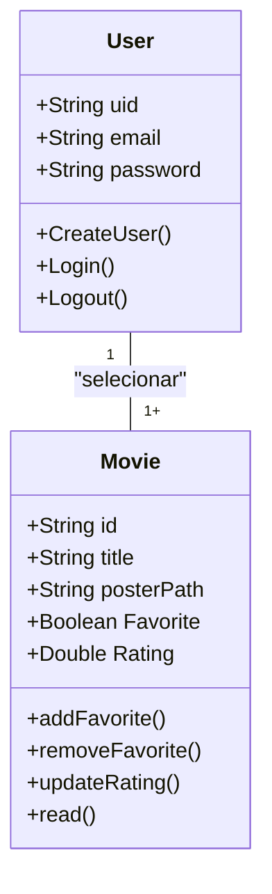

# CineFavorite - Formativa
Construindo um aplicativo do Zero - O CineFavorite permitirá criar uma conta e buscar filmes em uma api e montar uma galeria pessoal de filmes favoritos, com capas e notas.

## Objetivos
- Integrar o Aplicativo a uam API
- Criar uma conta pessoal no FireBase
- Armazenar informações para Cada usuários das preferencias solicitadas
- consultar informações de Filmes (Capas, Título)

## Levantamentos de Requisitos

- Funcionais

- Não Funcionais

## Diagramas

1. ### Diagrama de Classe
    Diagrama de que demonstra as entidades da aplicação

    - usuário (user) : classe criada pelo FireBase
        - email
        - senha
        - id
        - create()
        - login()
        - logout()

    - Filme (Movie) : Clase modelada pelo dev
        - number id:
        - String titulo: 
        - String posterPath:
        - boolean favorito:
        - double Nota:
        - adicionar()
        - update()
        - remover()
        - listarFavoritos()

2. ### Diagrama de Uso
 - teremos apenas o User 

3. ### Diagrama de Fluxo

 - 1° o usuario deve colocar seu email e senha e confirmar senha, se senha for === confirmar senha da inicio ao 2° passo.

 - 2° após criar o usuario ele é redirecionado a o dashboard (caso contrario ele é redirecionado a tela de criação de senha dnv) ele procura o filme que ele desejar.

 - 3° depois de achar o filme desejado (através do titulo e poster) ele pode favoritar o filme desejado e dar um rating(nota).

 - 4° ele pode listar os livros favoritos e caso queira pode excluir o filme selecionado dos favoritos.

## Prototipagem

- Colocar o link do figma

## Codificação